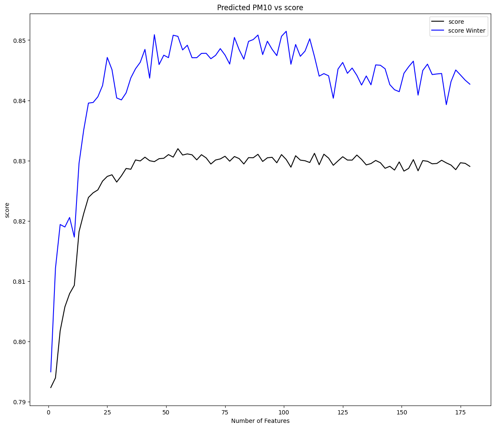
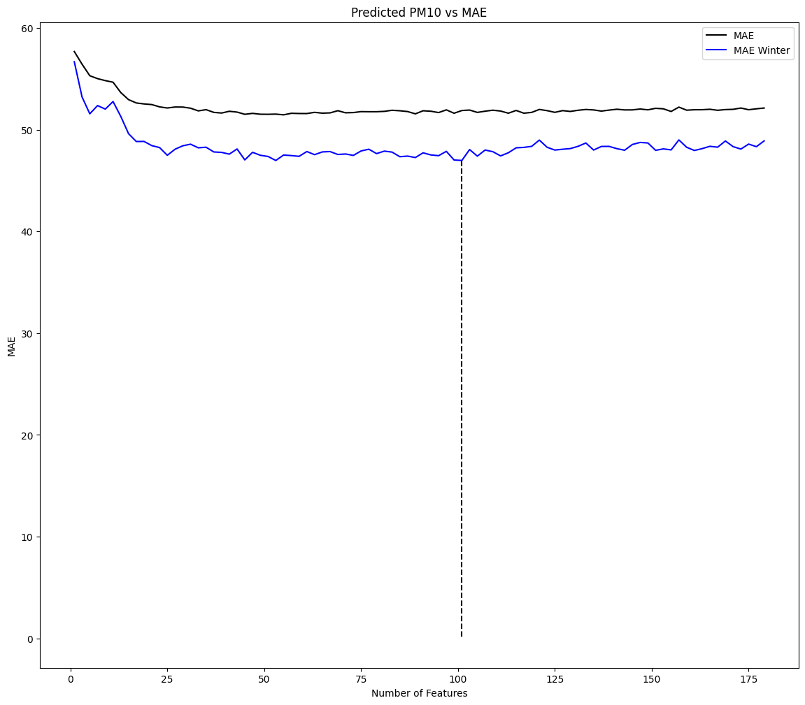

# Breezo

  

Having shifted recently to Gurgaon from Mumbai, I found myself obsessively looking at the AQI across various sources. I however felt that there was a lack of hyperlocal Air Quality forecast. Those found online were almost always aggregated across the entire city.

So, I built Breezo.

##  What Breezo Does

- Enter any Location within the Delhi-NCR triangle
- Recieve a detailed Air quality appraisle for the next 8 hours, including AQI_IN, AQ (Live) , PM2.5 and PM10
- Ask any follow up pertaining to the Air quality in this region to a chatbot.

---

##  Model Performance

Breezo uses a chained XGBoost regressor approach. Below are the $R^2$ scores for the prediction horizon (t+1 to t+8 hours) on the test set.
Test set: held out 2024-2025 data.
Train set: 2018-2023 data. 
This ensures no leakage

"Winter Score" denotes performance during critical high-pollution months where variance is highest- this is from months 11 through 2.

### PM2.5 Performance
| Forecast Horizon | Overall $R^2$ Score | Winter $R^2$ Score |
| :--- | :--- | :--- |
| **t+1 Hour** | **0.92** | **0.92** |
| **t+2 Hours** | 0.88 | 0.89 |
| **t+3 Hours** | 0.80 | 0.80 |
| **t+4 Hours** | 0.76 | 0.74 |
| **t+5 Hours** | 0.72 | 0.69 |
| **t+6 Hours** | 0.70 | 0.65 |
| **t+7 Hours** | 0.69 | 0.62 |
| **t+8 Hours** | 0.67 | 0.59 |

### PM10 Performance
| Forecast Horizon | Overall $R^2$ Score | Winter $R^2$ Score |
| :--- | :--- | :--- |
| **t+1 Hour** | **0.89** | **0.90** |
| **t+2 Hours** | 0.86 | 0.84 |
| **t+3 Hours** | 0.82 | 0.77 |
| **t+4 Hours** | 0.78 | 0.71 |
| **t+5 Hours** | 0.76 | 0.68 |
| **t+6 Hours** | 0.73 | 0.63 |
| **t+7 Hours** | 0.71 | 0.60 |
| **t+8 Hours** | 0.71 | 0.58 |

## How Breezo was built

### 1. The Data Layer
* **Sources:** Historical data from the **Central Pollution Control Board (CPCB)** and meteorological data from **Open-Meteo**. 8 years. 38 stations.
* Cleaning
    * **Interpolation:** Missing values (NaN) were handled dynamically. If `NaN ratio < 0.4`, the month was considered "clean", else "unclean"
    * **Imputation:** Consecutive missing hours (up to 8) were linearly interpolated in clean months. All other permutations of missing data were imputed using a yearly average of a specific month/day/hour for each station.

### 2. The ML Layer (The Engine)

Forecasting AQI was treated as a Time-Series Regression problem using **XGBoost**.
* **Feature Engineering:**
    * **Temporal Features:** Lag features (t-1, t-2), rolling means, and standard deviations over [1h, 2h, 3h] windows.
    * **Vector Logic:** "Master" features were created through data visualisation and guestimates of correlation of meteorological factors with pollutant concentrations
* **Dimensionalty Reduction:**
    * Pearson Correlation Coefficient values where used. Those with values >0.95 where removed.
    * RandomizedSearchCV (RSCV) with L1/L2 regularization was carried out- this optimises for model selection along with feature penalties. A peaking phenomenon was plotted for the best obtained hyperparams across the entire data set.

> **Visualization of Feature Peaking:**
> The plot below demonstrates how feature selection peaked at optimal numbers before performance plateaued.
>
>  

---
* **Chained Forecasting:** The model uses a recursive strategy. The prediction for `t+1` becomes a feature for predicting `t+2`, and so on.

### 3. The decision layer
Raw pollutant predictions (PM2.5/PM10) are converted into the official AQI Sub-Index using CPCB formulas.
* **Smoothing:** A 3-hour sliding window is applied to predictions to reduce noise and provide a stable "Confidence Score" for the forecast.
* Transitions are provided across windows.
* A simple mean across all windows, and best windows computation through code reduces hallucination- as compared to if  this task  is left to the LLM.

### 4. The Language Layer
* This is the open AI api.
* This takes in the runtime prompt provided by the previous layer and wraps it in plain language.
---

## Limitations

**Accuracy vs. Forecast Reality:**

* **The Winter Gap:** In extreme winter conditions, the model may occasionally miss random spikes caused by unprecedented localized events (e.g., random fires or extreme traffic jams) that are not captured in meteorological data.

## Learnings
1.  **Data > Algorithms:** No amount of hyperparameter tuning beat the performance gains from better cleaning and feature engineering.
2.  **Autocorrelation Rules:** For short horizons (0-8 hours), past pollution levels are a much stronger predictor than weather conditions

